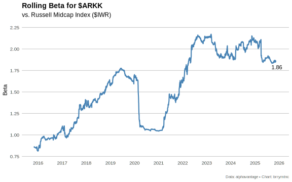
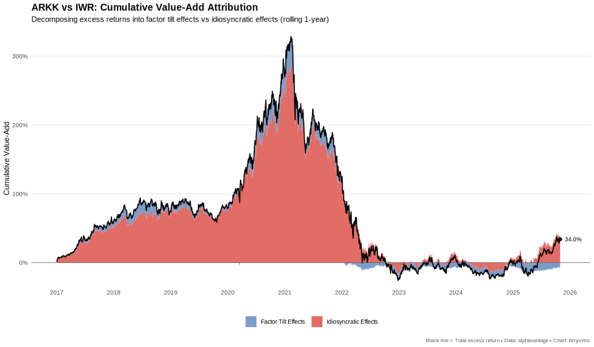

# Performance Analysis of ETF Returns

This R project fetches adjusted prices for a set of ETFs, computes daily log-returns, and applies a rolling linear regression against a market benchmark (IWV) to estimate alpha and beta over time.

## Features

- Fetches adjusted closing prices via `fetch_adjusted_prices()`
- Cleans and filters tickers for sufficient history
- Calculates daily log-returns
- Isolates market returns (IWV) and merges with each ticker
- Performs rolling linear regressions (window default: 756 trading days) to derive:
  - **alpha**: rolling intercept
  - **beta**: rolling slope against market return

## Project Structure

.Rbuildignore      # Files to exclude from build  
.Rprofile          # R session options  
DESCRIPTION        # Package metadata  
NAMESPACE          # Exported functions  
performanceanalysis.Rproj  
renv/              # Reproducible environment  
man/               # Documentation .Rd files  
R/                 # Source code  
tests/             # Test suite  
scripts/           # Example/driver scripts  

## Installation

1. Clone repo  
2. Initialize using renv and install dependencies from the lockfile:
   ```sh
   Rscript -e "renv::init()"
   Rscript -e "renv::restore()"
   ```  


## Rolling Regression Details

The idea of estimating an asset's systematic risk through a linear regression dates back to the early work on the Capital Asset Pricing Model (CAPM) in the late 1950s and 1960s by Sharpe, Lintner, and Mossin. In that framework, an individual stock's return is regressed on the market's return to obtain  
- **beta**: the slope, measuring sensitivity to market movements  
- **alpha**: the intercept, representing risk-adjusted outperformance  

We model returns rather than raw prices because prices are non-stationary and exhibit trends and heteroskedasticity. Returns (especially log-returns) are approximately homoscedastic and additive over time, satisfying the OLS assumptions more closely and making the model coefficients comparable across assets and periods.

## Our Implementation

Starting from `all_data`, a long-form df with columns:
- `date`  
- `ticker`  
- `adjusted_close`  

we first compute daily log-returns:
```r
return_data <- all_data %>%
  dplyr::arrange(ticker, date) %>%
  dplyr::group_by(ticker) %>%
  dplyr::mutate(return = log(adjusted_close / dplyr::lag(adjusted_close))) %>%
  dplyr::ungroup()
```
We isolate the market benchmark returns and join back so each row has both an asset return and `market_return`. Then, for each `ticker` group, we apply a sliding‐window OLS:
```r
linreg <- roll::roll_lm(
  x     = market_return,
  y     = return,
  width = roll_window  # e.g. 252 days
)
alpha <-  linreg$coefficients[, "(Intercept)"]
beta  <-  linreg$coefficients[, "x1"]
```

This yields time-series of rolling alpha and beta estimates for each ETF.

## Rolling Beta for ARKK



## Constrained Factor Regression for Return Decomposition

Beyond single-factor models, we can decompose a target asset's returns into a weighted combination of multiple factor exposures. This is particularly useful for understanding the style composition of actively managed funds or complex ETFs.

### The Factor-Mimicking Portfolio Approach

The core idea is to construct a **factor-mimicking portfolio** that closely replicates the return profile of the target asset. We achieve this by solving a constrained regression problem:

```
r_target = α + β₁ × r_factor1 + β₂ × r_factor2 + ... + βₙ × r_factorₙ + ε
```

subject to:
- **Non-negativity**: βᵢ ≥ 0 for all i (long-only positions)
- **Unit sum**: Σβᵢ = 1 (fully invested portfolio)

These constraints ensure the factor weights represent the long only mix of (low cost) factor ETFs that investors could implement to replicate the return profile of the target fund. The resulting coefficients show how much of each factor exposure would be needed to replicate the target's return profile.

### Implementation

Our `constrained_linear_regression()` function uses quadratic programming to solve:

```r
factor_decomposition <- regression_data %>%
    dplyr::mutate(
        roll_res = list(roll_constrained_lm(
            x = as.matrix(dplyr::select(., dplyr::all_of(factor_cols))),
            y = arkk_return,
            width = roll_window,
            non_negative = TRUE,
            sum_to_one = TRUE
        ))
    )
```

This produces time-varying factor weights that sum to 1 and are always non-negative, representing the evolving style composition of the target fund.

## Rolling Multi-Factor Decomposition of ARKK


The stacked area chart above shows how ARKK's factor exposures have evolved over time using our 8-factor model:
- **Large Value** (IWD) and **Large Growth** (IWF) 
- **Small Value** (IWN) and **Small Growth** (IWO)
- **Momentum** (MTUM), **Min Vol** (USMV), **Quality** (QUAL)
- **Small Quality** (IJR)

Each colored band represents the rolling 3-year weight that would be allocated to that factor to best approximate ARKK's return profile during that period.

## Benchmark Comparison: ARKK vs IWR Factor Loading Differences

To understand how ARKK's factor exposures differ from the Russell Midcap benchmark, we perform **parallel constrained regressions** on both ARKK and IWR (the Russell Midcap ETF) against the same 8-factor model. This reveals ARKK's active tilts relative to the midcap benchmark.

### Methodology

1. **Dual Regression Setup**: Run identical rolling 1-year constrained regressions for both ARKK and IWR
   - Target: ARKK returns or IWR returns
   - Factors: IWD, IWF, IWN, IWO, MTUM, USMV, QUAL, IJR
   - Constraints: Non-negative weights, sum to 1, plus intercept

2. **Difference Calculation**: For each date and factor, compute:
   ```
   Δβᵢ = β_ARKK,i - β_IWR,i
   ```
   Positive differences indicate ARKK overweights that factor relative to the benchmark; negative values indicate underweights.

3. **Materiality Filter**: For visualization clarity, we only display factors where `max(|Δβᵢ|) ≥ 5%` across the time series. **Note**: All 8 factors are used in both regressions regardless of their materiality for plotting.

4. **Ordering**: Factors are arranged from highest to lowest based on their long-term average difference.

### Interpretation

The bar charts show ARKK's active factor tilts over time:
- Bars above zero → ARKK overweight relative to IWR
- Bars below zero → ARKK underweight relative to IWR
- Extreme values (near ±100%) indicate concentrated single-factor allocations

This analysis quantifies how ARKK's style has deviated from the Russell Midcap benchmark, particularly during volatile periods like the 2020 COVID crash.

## ARKK vs IWR: Factor Loading Differences Over Time


## Cumulative Factor Attribution Analysis

Building on the factor decomposition framework, we can treat the rolling factor weights as hypothetical portfolio allocations and perform **performance attribution** to decompose ARKK's total excess return (relative to IWR) into two sources:

1. **Factor Tilt Effects**: Return impact from factor tilts (over/underweighting factors relative to the benchmark)
2. **Idiosyncratic Effects**: Residual return from stock selection and interaction effects not explained by factor exposures

### Methodology

**Out-of-Sample Attribution**: Uses factor weights estimated at time *t* to explain returns at time *t+1*. This prevents look-ahead bias and mimics how portfolios would be constructed in practice.

**Daily Decomposition**:
```
excess_return_t = (actual_ARKK_t - actual_IWV_t)
factor_contribution_t = (expected_ARKK_t - expected_IWV_t)  
selection_effect_t = (actual_ARKK_t - expected_ARKK_t) - (actual_IWV_t - expected_IWV_t)
```

where expected returns = Σ(β_i × r_factor_i) using weights from *t-1*.

**Carino Linking**: Converts daily attribution into cumulative metrics using logarithmic weighting to maintain the additive identity:
```
cumulative_factor_tilt + cumulative_idiosyncratic = cumulative_excess
```

Standard multiplicative compounding would violate this identity. Carino's method (industry standard for GIPS-compliant attribution) allocates the total compounded excess return proportionally based on log-weighted daily contributions.

### Interpretation

- **Cumulative Factor Tilt Effects**: Value-add from ARKK's active factor positioning vs IWR
- **Cumulative Idiosyncratic Effects**: Value-add from ARKK's security selection (idiosyncratic) and timing (trading) effects
- **Sum**: Total cumulative excess return (ARKK vs IWR)

Negative values indicate underperformance. The decomposition reveals whether poor performance stems from common factor overweights / underweights or security selection.

## ARKK vs IWR: Cumulative Value-Add Attribution



The stacked area chart shows how ARKK's cumulative performance (vs IWR) breaks down into factor tilt effects and idiosyncratic effects, with the black line tracking total excess return over time.
