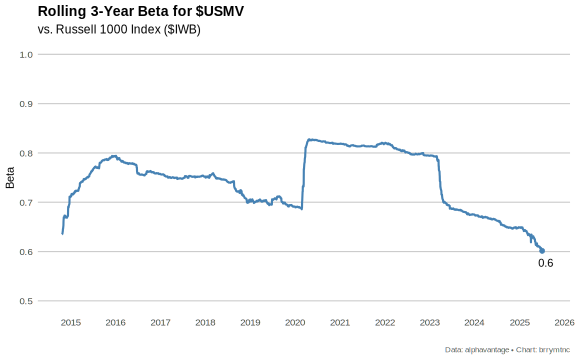

# Performance Analysis of ETF Returns

This R project fetches adjusted prices for a set of ETFs, computes daily log-returns, and applies a rolling linear regression against a market benchmark (IWB) to estimate alpha and beta over time.

## Features

- Fetches adjusted closing prices via `fetch_adjusted_prices()`
- Cleans and filters tickers for sufficient history
- Calculates daily log-returns
- Isolates market returns (IWB) and merges with each ticker
- Performs rolling linear regressions (window default: 756 trading days) to derive:
  - **alpha**: rolling intercept
  - **beta**: rolling slope against market return

## Project Structure

.Rbuildignore      # Files to exclude from build  
.Rprofile          # R session options  
DESCRIPTION        # Package metadata  
NAMESPACE          # Exported functions  
performanceanalysis.Rproj  
renv/              # Reproducible environment  
man/               # Documentation .Rd files  
R/                 # Source code  
tests/             # Test suite  
scripts/           # Example/driver scripts  

## Installation

1. Clone repo  
2. Initialize using renv and install dependencies from the lockfile:
   ```sh
   Rscript -e "renv::init()"
   Rscript -e "renv::restore()"
   ```  


## Rolling Regression Details

The idea of estimating an asset's systematic risk through a linear regression dates back to the early work on the Capital Asset Pricing Model (CAPM) in the late 1950s and 1960s by Sharpe, Lintner, and Mossin. In that framework, an individual stock's return is regressed on the market's return to obtain  
- **beta**: the slope, measuring sensitivity to market movements  
- **alpha**: the intercept, representing risk-adjusted outperformance  

We model returns rather than raw prices because prices are non-stationary and exhibit trends and heteroskedasticity. Returns (especially log-returns) are approximately homoscedastic and additive over time, satisfying the OLS assumptions more closely and making the model coefficients comparable across assets and periods.

## Our Implementation

Starting from `all_data`, a long-form df with columns:
- `date`  
- `ticker`  
- `adjusted_close`  

we first compute daily log-returns:
```r
return_data <- all_data %>%
  dplyr::arrange(ticker, date) %>%
  dplyr::group_by(ticker) %>%
  dplyr::mutate(return = log(adjusted_close / dplyr::lag(adjusted_close))) %>%
  dplyr::ungroup()
```
We isolate the market benchmark (the $IWB Russell 1000 ETF) returns and join back so each row has both an asset return and `market_return`. Then, for each `ticker` group, we apply a sliding‐window OLS:
```r
linreg <- roll::roll_lm(
  x     = market_return,
  y     = return,
  width = roll_window  # e.g. 252 days
)
alpha <-  linreg$coefficients[, "(Intercept)"]
beta  <-  linreg$coefficients[, "x1"]
```

This yields time-series of rolling alpha and beta estimates for each ETF.

## Rolling 3-Year Beta for USMV



## Constrained Factor Regression for Return Decomposition

Beyond single-factor models, we can decompose a target asset's returns into a weighted combination of multiple factor exposures. This is particularly useful for understanding the style composition of actively managed funds or complex ETFs.

### The Factor-Mimicking Portfolio Approach

The core idea is to construct a **factor-mimicking portfolio** that closely replicates the return profile of the target asset. We achieve this by solving a constrained regression problem:

```
r_target = α + β₁ × r_factor1 + β₂ × r_factor2 + ... + βₙ × r_factorₙ + ε
```

subject to:
- **Non-negativity**: βᵢ ≥ 0 for all i (long-only positions)
- **Unit sum**: Σβᵢ = 1 (fully invested portfolio)

These constraints ensure the factor weights represent realistic portfolio allocations that institutional investors could implement. The resulting coefficients show how much of each factor exposure would be needed to replicate the target's return behavior.

### Implementation

Our `constrained_linear_regression()` function uses quadratic programming to solve:

```r
factor_decomposition <- regression_data %>%
    dplyr::mutate(
        roll_res = list(roll_constrained_lm(
            x = as.matrix(dplyr::select(., dplyr::all_of(factor_cols))),
            y = arkk_return,
            width = roll_window,
            non_negative = TRUE,
            sum_to_one = TRUE
        ))
    )
```

This produces time-varying factor weights that sum to 1 and are always non-negative, representing the evolving style composition of the target fund.

## Rolling 3-Year Multi-Factor Decomposition of ARKK


The stacked area chart above shows how ARKK's factor exposures have evolved over time using our 8-factor model:
- **Large Value** (IWD) and **Large Growth** (IWF) 
- **Small Value** (IWN) and **Small Growth** (IWO)
- **Momentum** (MTUM), **Min Vol** (USMV), **Quality** (QUAL)
- **Small Quality** (IJR)

Each colored band represents the rolling 3-year weight that would be allocated to that factor to best approximate ARKK's return profile during that period.
